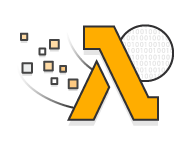
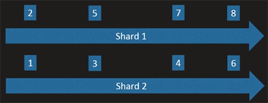

    

# Intended Learning Strategy

1. Spend 10 minutes on the [Serverless Hello World](https://aws.amazon.com/getting-started/tutorials/run-serverless-code) tutorial. You will:
    1. Create a Lambda with code populated for you
    1. Test the Lambda with simple sample data
    1. View the logs CloudWatch created for you in Lambda's "Monitoring" tab
1. This repo is a concise summary and _replacement_ of the [AWS Lambda](https://acloud.guru/learn/aws-lambda) tutorial by "A Cloud Guru". The course link is provided in case you need video examples (such as how to hook up AWS Kinesis to Lambda).

# Section 1

### What is Serverless?

- __What does "serverless" mean?__ - (0:48) serverless means you're not in charge of the servers, it doesn't mean that there are no servers.
- __What are the tenets of serverless?__ - (1:32)
  - You bring the code, provider brings the infrastructure
  - Scale seamlessly with demand
  - Pay as you go, but never pay for idle time
- __What components will be needed for a full web app? (according to this video)__ - (3:12)
  - Lambda - Functions as a Service (compute)
  - API Gateway - HTTP endpoints (for your lambda functions) as a Service (connectivity)
  - DynamoDB - NoSQL (storage)
  - S3 - object store (storage)
  - Cognito - User management & authentication (security)
  - Certificate Manager - free. Automatically updates SSL certificates for API gateway (security)

### Why Lambda

- __What are some use cases?__ (1:00)
  - [ETL](https://www.webopedia.com/TERM/E/ETL.html) jobs - when you extract data, transform it, and load it into another data source. You can:
    - take data that's being put into S3 and load it into a Redshift database.
    - take data that's coming in via HTTP calls and put it into a SQL database.
  - APIs - Creating Rest APIs with API gateway.
  - Mobile backends - Lambda will do the "compute" part (either through AWS mobile services, or API Gateway, or directly invoking from the SDK)
  - Infrastructure automation - Reacting to events. If an instance is going to be retired, your Lambda can react and remediate that automatically
  - Data validation - Since Lambda can listen to events from DynamoDB and Aurora, Lambda can do data validation. You can let data be written to a database, and Lambda can pick that up (via a trigger) and can validate an address is correctly formatted.
  - Security remediation - Some AWS Services are built around Lambda functions. AWS Config lets you supply custom Lambda functions to remediate security and configuration issues that AWS Config finds.

# Section 2

### About Blueprints and Handlers?

- __What is AWS Lambda's "Serverless Application Repository"__ - (1:20) lets you find deploy serverless apps published by developers, companies, and partners on AWS

### Create the Function

- __What happens when you increase Lambda memory?__ - (2:14) Increasing memory also increases CPU and network bandwidth (along width cost). If you need more memory to finish something, increasing memory can actually save you money if Lambda finishes faster.
- __How get more cores for your Lambda?__ - (3:12) if you go above 1500MB of memory you automatically get 2 cores. This helps in parallel processing.

### Testing and Logging

- __Where are Lambda logs saved?__ - (1:57) Cloudwatch.
- __Are logs saved automatically?__ - (2:15) Yes.
- __How can you get "warn", "info", and "debug" level logging?__ - (2:04) `console.log` is just standard logging. To get "warn", "info" and "debug" level logging you need to find a logging library.

# Section 3

### Updating Lambda Functions with the AWS CLI

- __What is `context` variable in Javascript's `exports.handler = async (event, context) => ...`?__ - (2:20) lets us communicate with the Lambda runtime. One example is `context.getRemainingTimeInMillis()`

### Function Versions and Qualifiers

- __What's a qualifier/version?__ - (0:30) a named pointer to Lambda code along with its configuration
- __What is `$LATEST` qualifier?__ - the default qualifier. Points to your most recent version of your Lambda function.
- __What is a Lambda alias?__ - (2:10) a pointer to a specific version of a Lambda function.
- __How can you do A/B testing with Lambda?__ - (2:35) when creating an alias, you can choose 2 different versions of your Lambda to invoke.

### Function Outputs and Timeouts

- __Where do your Lambda function's return value(s) get stored?__ - (0:10) they're not stored anywhere by default. If Lambda was reached through API gateway, the return value would be sent back to the user.
- __What are 2 things that can cause your Lambda to be killed?__ - Run out of memory, or run out of time.
- __What is API Gateway's hard time limit for Lambdas?__ - (2:05) 29 seconds
- __What can you do if your job (in Lambda) is too big?__
  - Break your job into smaller bits, spinning off multiple jobs from 1 job.
  - Use another service
    - Fargate - a container runtime that's easier to run than classic ECS since you're not running the container instances yourself.
    - AWS Batch - aimed at data processing workloads and big data.
    - S3 Select - pulling values out of structured s3 objects.

# Section 4 - Kinesis

### Introduction to Kinesis

- __What is Kinesis?__ - (0:25) an event streaming service. A gigantic log where all events come in as ordered streams by time.
- __What's a Kinesis stream?__ - (1:00) a group of shards that's configurable. You can add/remove shards as needs change.
- __Do shards maintain old events?__ - (1:10) every shard maintains last 24 hours of events, so if a new client comes online, it can process the last 24 hours of data. Or, if your real-time processing system goes offline, once it comes back online it can access the data it missed.
- __In Kinesis, what's the releationship between events and shards?__ (1:35) Shards don't have the same events. Events are put in a kinesis stream and assigned a shard (such as events 1-8 below). Different events go on different shards.

- __How does Lambda receive a group of events?__ - (1:45) Lambda can receive up to 100 events, but they will all be from the same shard.

### Create a Stream and Function Trigger

- __What do shards do?__ - (0:40) They determine stream capacity. Each shard gives you approximately 1 MB/s throughput
- __How are Kinesis payloads encoded?__ (0:50) base-64. You must decode it in your Lambda function.
- __What permissions do we need for Lambda/Kinesis connection?__ - (1:06) create an IAM role in IAM console to access our stream. Attach the `AWSLambdaKinesisExecutionRole` policy to the role, which allows AWS to let Kinesis invoke your lambda function, and pass it records from the Kinesis stream.
- __How handle "streaming" data?__ - (2:10) '"Batch size" is how many records we receive at a time, like 100. In the Lambda, we can loop through these records

### End-to-End Testing with Kinesis Events

- __What is 1 way to put records into a Kinesis stream?__ - (0:05) Can use AWS CLI to put JSON records into a Kinesis stream. The CLI will base-64 encode the records for you.

# Section 5 - DynamoDB

### Create and Test the Function

- __What is 1 use case for DynamoDB with Lambda?__ - (Entire section) Can have DynamoDB be a trigger for Lambda. When an item is written to DynamoDB, a Lambda can be triggered, which can add additional key/values to that item. For example, Lambda can take DynamoDB item with `gross` and `cost`, calculate `profit = gross - cost`, and write that item back to DynamoDB with the additional key/value pair for `profit`.
